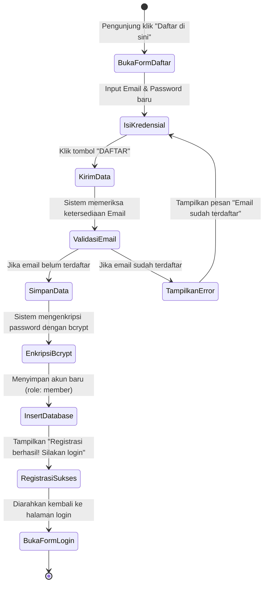
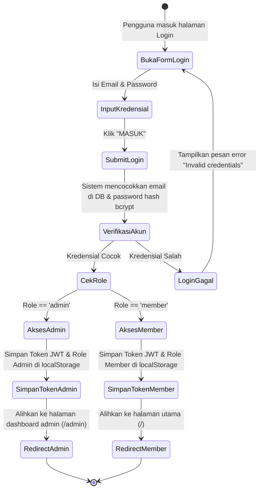
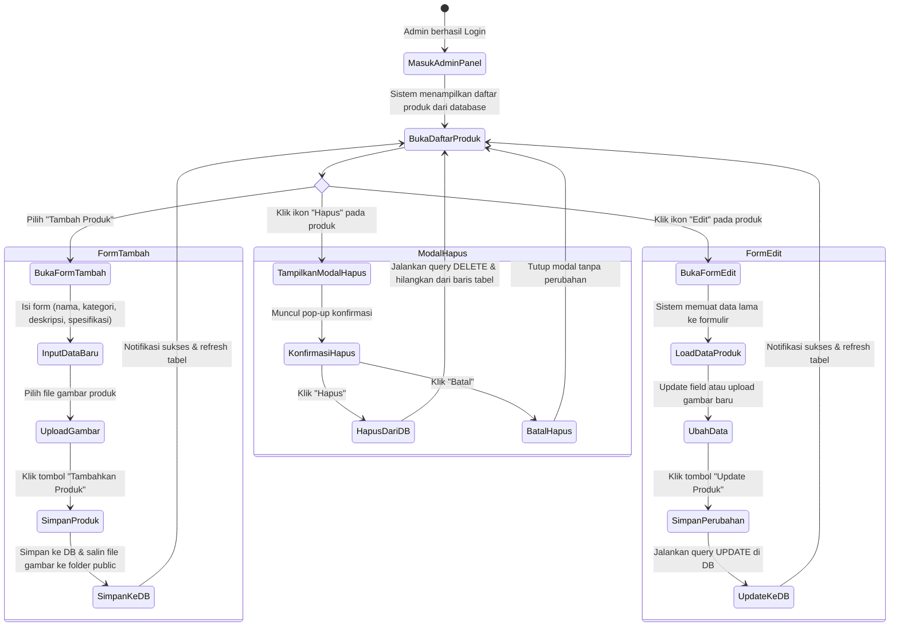
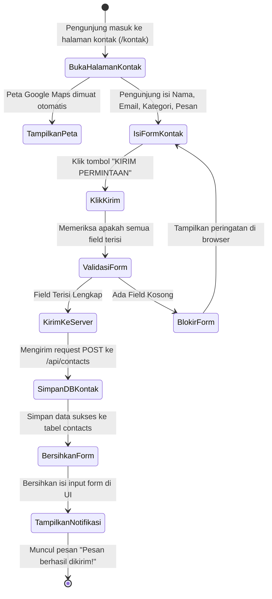
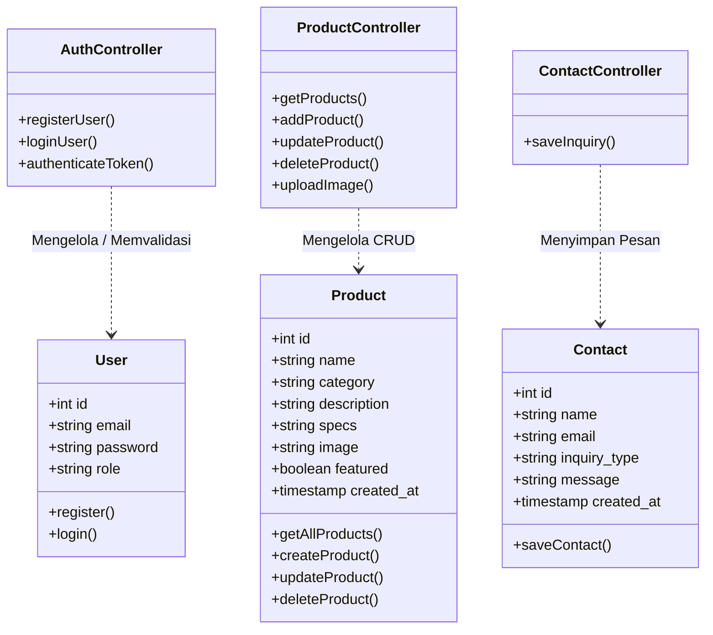
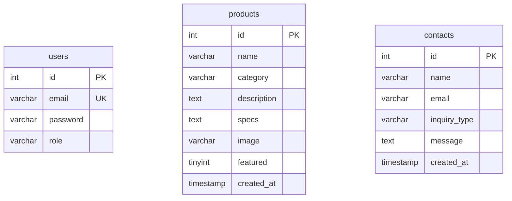

# PERBAIKAN & REVISI LAPORAN KP (SINKRONISASI DENGAN WEB)

Dokumen ini berisi materi lengkap lanjutan untuk **BAB III (Pembahasan)** dan **BAB IV (Penutup)** laporan Kerja Praktek Anda. Semua bagian di bawah ini telah diselaraskan dengan fitur dan arsitektur kode nyata dari aplikasi web **CV. Mandiri Perdana Sukses** yang menggunakan **React** di frontend, **Express** di backend, dan **MySQL** sebagai database.

Anda dapat menyalin naskah ini langsung ke file Microsoft Word (`.docx`) laporan Anda sesuai dengan nomor sub-bab yang tertera.

---

## BAB III PEMBAHASAN (LANJUTAN)

### 3.4.1.2 Rincian Skenario Use Case (Use Case Specification)
Berikut adalah penjelasan rinci mengenai skenario interaksi antara aktor (Admin, Member, dan Pengunjung) dengan sistem informasi promosi dan pengelolaan produk CV. Mandiri Perdana Sukses.

---

#### **UC-01: Registrasi Member**
*   **Aktor Utama**: Pengunjung (Visitor)
*   **Deskripsi**: Proses bagi pengunjung untuk mendaftarkan akun baru agar terdaftar sebagai Member di dalam sistem.
*   **Prakondisi**: Pengunjung belum masuk ke akun apa pun dan berada pada halaman Login/Daftar.
*   **Pascakondisi**: Akun member baru berhasil tersimpan di dalam database tabel `users` dengan role `member`.

| Aksi Aktor | Reaksi Sistem |
| :--- | :--- |
| **Skenario Utama (Normal Flow)** | |
| 1. Pengunjung membuka halaman login/register dan mengklik link "Daftar di sini". | 2. Sistem menampilkan form registrasi member (Input Email dan Password). |
| 3. Pengunjung memasukkan Email dan Password baru, lalu mengklik tombol "DAFTAR". | 4. Sistem melakukan validasi format email dan enkripsi password menggunakan bcrypt. |
| | 5. Sistem menyimpan data ke database tabel `users`. |
| | 6. Sistem menampilkan pesan sukses "Registrasi berhasil! Silakan login." dan mengarahkan kembali ke form login. |
| **Skenario Alternatif (Alternative Flow)** | |
| 3a. Email yang dimasukkan sudah terdaftar di database. | 4a. Sistem mendeteksi duplikasi data (`ER_DUP_ENTRY`). |
| | 5a. Sistem membatalkan penyimpanan data dan menampilkan pesan error "Email sudah terdaftar". |

---

#### **UC-02: Login Akun (Admin & Member)**
*   **Aktor Utama**: Admin, Member
*   **Deskripsi**: Proses validasi kredensial pengguna (email dan password) untuk masuk ke halaman berhak akses khusus (Admin Panel untuk Admin, dan akses Member untuk Member).
*   **Prakondisi**: Pengguna sudah memiliki akun terdaftar di database.
*   **Pascakondisi**: Pengguna mendapatkan token JWT (JSON Web Token) dan diarahkan ke halaman yang sesuai dengan hak aksesnya.

| Aksi Aktor | Reaksi Sistem |
| :--- | :--- |
| **Skenario Utama (Normal Flow - Admin)** | |
| 1. Pengguna membuka halaman Login. | 2. Sistem menampilkan form Login (Input Email dan Password). |
| 3. Admin memasukkan Email dan Password admin, lalu mengklik tombol "MASUK". | 4. Sistem memverifikasi kecocokan email dan mencocokkan password terenkripsi menggunakan bcrypt. |
| | 5. Sistem menghasilkan token JWT berisi ID pengguna dan Role (`admin`). |
| | 6. Sistem menyimpan token dan role ke `localStorage` browser. |
| | 7. Sistem mengarahkan Admin ke halaman dashboard Admin Panel (`/admin`). |
| **Skenario Utama (Normal Flow - Member)** | |
| 3. Member memasukkan Email dan Password member, lalu mengklik tombol "MASUK". | 4. Sistem memverifikasi kredensial member. |
| | 5. Sistem menghasilkan token JWT dengan Role (`member`). |
| | 6. Sistem menyimpan token dan role ke `localStorage` browser dan mengarahkan ke Halaman Utama (`/`). |
| **Skenario Alternatif (Alternative Flow)** | |
| 3a. Pengguna memasukkan password atau email yang salah. | 4a. Sistem mendeteksi ketidakcocokan kredensial. |
| | 5a. Sistem menampilkan pesan kesalahan "Invalid credentials" dan tetap berada di halaman Login. |

---

#### **UC-03: Mengelola Data Produk (CRUD) - Admin**
*   **Aktor Utama**: Admin
*   **Deskripsi**: Proses pengelolaan katalog produk meliputi melihat daftar produk, menambah produk baru, mengunggah gambar produk, memperbarui informasi produk, dan menghapus produk.
*   **Prakondisi**: Admin sudah berhasil Login dan berada di Admin Panel (`/admin`).
*   **Pascakondisi**: Perubahan data produk berhasil diperbarui pada database tabel `products`.

| Aksi Aktor | Reaksi Sistem |
| :--- | :--- |
| **Skenario Utama (Normal Flow - Tambah Produk)** | |
| 1. Admin memilih menu "Tambah Produk". | 2. Sistem menampilkan form input produk (Nama, Kategori, Deskripsi, Spesifikasi Dinamis, File Gambar, dan Checkbox Featured). |
| 3. Admin mengisi data produk, menentukan spesifikasi, memilih file gambar, lalu mengklik "TAMBAHKAN PRODUK". | 4. Sistem mengunggah file gambar ke server via `/api/upload` dan menyimpan path gambar (`/images/filename`). |
| | 5. Sistem memproses penyimpanan data produk baru ke tabel `products` via `/api/products` (POST) dengan header otorisasi Bearer Token JWT. |
| | 6. Sistem menyimpan data produk dan menampilkan notifikasi "Produk berhasil ditambahkan!". |
| | 7. Sistem mengarahkan kembali ke halaman "Daftar Produk" dan memperbarui tabel. |
| **Skenario Utama (Normal Flow - Edit Produk)** | |
| 1. Admin mengklik tombol "Edit" (ikon pensil) pada salah satu produk di daftar produk. | 2. Halaman memuat data produk ke form edit secara otomatis. |
| 3. Admin memperbarui informasi produk atau mengunggah gambar baru, lalu mengklik "UPDATE PRODUK". | 4. Sistem mengirimkan data terupdate ke `/api/products/:id` (PUT). |
| | 5. Sistem memperbarui data di database dan menampilkan notifikasi "Produk berhasil diupdate!". |
| **Skenario Utama (Normal Flow - Hapus Produk)** | |
| 1. Admin mengklik tombol "Hapus" (ikon tempat sampah) pada salah satu produk di daftar. | 2. Sistem menampilkan modal pop-up konfirmasi hapus. |
| 3. Admin mengklik tombol "Hapus" pada modal. | 4. Sistem mengirimkan permintaan ke `/api/products/:id` (DELETE). |
| | 5. Sistem menghapus data produk dari database, menutup modal, dan menampilkan pesan "Produk berhasil dihapus!". |

---

#### **UC-04: Mengirim Pesan Kontak (Contact Inquiries)**
*   **Aktor Utama**: Pengunjung / Member
*   **Deskripsi**: Proses mengirimkan formulir pertanyaan proyek atau permintaan informasi seputar produk kepada pihak CV. Mandiri Perdana Sukses.
*   **Prakondisi**: Pengguna berada pada halaman Kontak (`/kontak`).
*   **Pascakondisi**: Data pesan berhasil disimpan ke dalam database tabel `contacts`.

| Aksi Aktor | Reaksi Sistem |
| :--- | :--- |
| **Skenario Utama (Normal Flow)** | |
| 1. Pengguna membuka halaman Kontak. | 2. Sistem menampilkan form kontak dan peta lokasi Google Maps. |
| 3. Pengguna mengisi Nama, Email, Jenis Pertanyaan (dropdown), dan Pesan Kebutuhan, lalu mengklik "KIRIM PERMINTAAN". | 4. Sistem melakukan validasi input formulir. |
| | 5. Sistem mengirim data formulir ke backend `/api/contacts` (POST). |
| | 6. Sistem menyimpan pesan ke database tabel `contacts` dan memberikan pesan sukses "Pesan berhasil dikirim!". |
| | 7. Sistem membersihkan isi form secara otomatis. |
| **Skenario Alternatif (Alternative Flow)** | |
| 3a. Pengguna mengosongkan salah satu input wajib. | 4a. Browser memblokir pengiriman formulir dengan validasi HTML5 (`required`). |

---

#### **UC-05: Navigasi dan Melihat Detail Produk**
*   **Aktor Utama**: Pengunjung / Member
*   **Deskripsi**: Proses menjelajahi katalog produk perusahaan, melakukan penyaringan (filtering) berdasarkan kategori, mencari berdasarkan kata kunci nama produk, dan melihat detail spesifikasinya.
*   **Prakondisi**: Pengguna berada di halaman utama atau halaman produk.
*   **Pascakondisi**: Pengguna mendapatkan informasi produk yang lengkap dan akurat.

| Aksi Aktor | Reaksi Sistem |
| :--- | :--- |
| **Skenario Utama (Normal Flow)** | |
| 1. Pengguna membuka menu "Produk" (`/produk`). | 2. Sistem memuat seluruh data dari database tabel `products` melalui API GET `/api/products` secara real-time. |
| | 3. Sistem menampilkan daftar produk dalam bentuk kartu grid interaktif lengkap dengan gambar, nama, deskripsi singkat, kategori, dan tabel spesifikasi teknis. |
| 4. Pengguna memilih filter kategori (misal: "Videotron") atau mengetik nama produk di kolom pencarian. | 5. Sistem memfilter tampilan daftar produk secara dinamis di sisi klien tanpa perlu memuat ulang halaman. |

---

#### **UC-06: Kontak Langsung (WhatsApp & Google Maps)**
*   **Aktor Utama**: Pengunjung / Member
*   **Deskripsi**: Menghubungi perwakilan perusahaan secara langsung melalui obrolan WhatsApp atau melacak lokasi kantor fisik perusahaan di Google Maps.
*   **Prakondisi**: Pengguna berada di halaman Kontak (`/kontak`).
*   **Pascakondisi**: Pengguna diarahkan ke tautan eksternal WhatsApp Web/Aplikasi atau melihat peta interaktif Google Maps.

| Aksi Aktor | Reaksi Sistem |
| :--- | :--- |
| **Skenario Utama (Normal Flow - WhatsApp)** | |
| 1. Pengguna mengklik tombol "HUBUNGI VIA WHATSAPP" pada halaman kontak. | 2. Sistem mendeteksi nomor kontak WhatsApp dari konstanta sistem. |
| | 3. Sistem membuka tab baru dan mengarahkan pengguna ke link API WhatsApp (`https://wa.me/62812...`). |
| **Skenario Utama (Normal Flow - Google Maps)** | |
| 1. Pengguna melihat bagian peta lokasi di halaman kontak. | 2. Sistem memuat frame interaktif Google Maps (`iframe`) yang disematkan dengan koordinat lokasi kantor CV. Mandiri Perdana Sukses. |

---

### 3.4.1.3 Prompt Draw.io AI & Kode Diagram Use Case

Untuk membuat diagram Use Case secara otomatis menggunakan AI di Draw.io, ikuti langkah berikut:
1. Buka situs [Draw.io](https://app.diagrams.net/).
2. Klik menu **Insert** (ikon tanda tambah `+` di toolbar atas) > **Advanced** > **Mermaid**.
3. Salin kode Mermaid di bawah ini dan tempelkan (paste) ke dalam kotak dialog yang muncul, lalu klik **Insert**.

#### **Prompt Teks untuk AI (Jika menggunakan asisten AI generatif / fitur AI Draw.io):**
```text
Buatkan diagram Use Case UML untuk sistem informasi profil perusahaan dan manajemen produk CV. Mandiri Perdana Sukses. 
Terdapat 3 aktor: Pengunjung (Visitor), Member, dan Admin.
- Pengunjung dapat: Mendaftar Member (Registrasi), Login Akun, Melihat Daftar & Detail Produk, Menghubungi via WhatsApp & Google Maps, dan Mengirim Pesan Kontak (Contact Form).
- Member dapat: Login Akun, Melihat Daftar & Detail Produk, Menghubungi via WhatsApp & Google Maps, dan Mengirim Pesan Kontak.
- Admin dapat: Login Akun dan Mengelola Data Produk (CRUD: Create, Read, Update, Delete Produk, serta mengunggah gambar).
Gunakan tata letak kiri-ke-kanan yang rapi dan profesional.
```

#### **Kode Diagram Use Case (Sintaks Mermaid):**
```mermaid
left-to-right-direction
actor Visitor as "Pengunjung (Visitor)"
actor Member as "Member"
actor Admin as "Admin"

rectangle "Sistem Informasi CV Perdana Sukses Mandiri" {
  usecase UC01 as "UC-01: Registrasi Member"
  usecase UC02 as "UC-02: Login Akun"
  usecase UC03 as "UC-03: Melihat Daftar & Detail Produk"
  usecase UC04 as "UC-04: Menghubungi via WhatsApp & Maps"
  usecase UC05 as "UC-05: Mengirim Pesan Kontak"
  usecase UC06 as "UC-06: Mengelola Data Produk (CRUD)"
}

Visitor --> UC01
Visitor --> UC02
Visitor --> UC03
Visitor --> UC04
Visitor --> UC05

Member --> UC02
Member --> UC03
Member --> UC04
Member --> UC05

Admin --> UC02
Admin --> UC06
```

---

### 3.4.2 Activity Diagram
Activity diagram memodelkan alur kerja (workflow) atau aktivitas sistem untuk setiap proses utama.

#### **1. Activity Diagram Registrasi Member**
*   **Prompt AI**: *"Buat activity diagram untuk registrasi member. Dimulai dari pengunjung mengklik tombol daftar, mengisi formulir email & password, validasi email unik di database, enkripsi password, penyimpanan data user baru, dan selesai dengan pesan sukses."*
*   **Kode Mermaid**:


#### **2. Activity Diagram Login Pengguna (Admin & Member)**
*   **Prompt AI**: *"Buat activity diagram login user. Dimulai dengan user menginput email & password, sistem memverifikasi kredensial di database, mencocokkan password hash bcrypt, jika sukses simpan JWT token di localStorage dan arahkan ke dashboard admin (jika admin) atau homepage (jika member), jika gagal tampilkan pesan invalid credentials."*
*   **Kode Mermaid**:


#### **3. Activity Diagram Pengelolaan Data Produk (CRUD oleh Admin)**
*   **Prompt AI**: *"Buat activity diagram untuk pengelolaan data produk (CRUD) oleh Admin. Alur meliputi: melihat daftar produk, proses tambah produk dengan upload gambar, proses edit data produk, dan proses hapus produk dengan modal konfirmasi."*
*   **Kode Mermaid**:


#### **4. Activity Diagram Mengirim Pesan Kontak**
*   **Prompt AI**: *"Buat activity diagram pengunjung mengirim formulir kontak. Pengunjung mengisi data nama, email, tipe inquiry, pesan. Klik submit. Sistem validasi input kosong, kirim ke database via API POST contacts, simpan sukses, bersihkan form, dan tampilkan pesan sukses."*
*   **Kode Mermaid**:


---

### 3.4.3 Sequence Diagram
Sequence diagram menggambarkan interaksi antar-objek dan urutan pertukaran pesan (message) seiring berjalannya waktu.

#### **1. Sequence Diagram Login Akun**
*   **Prompt AI**: *"Buat sequence diagram login akun. Aktor: User (Admin/Member), Boundary: Login Page (React UI), Control: Express API Router, Entity: Database MySQL (users). Gambarkan alur pengiriman kredensial, validasi bcrypt, pembuatan JWT, dan respons pengalihan halaman."*
*   **Kode Mermaid**:
```mermaid
sequenceDiagram
    autonumber
    actor User as Pengguna (Admin/Member)
    boundary UI as Halaman Login (React UI)
    control Server as Express API (/api/login)
    entity DB as Database MySQL (users)
    
    User->>UI: Mengisi Email & Password
    User->>UI: Mengklik tombol "MASUK"
    UI->>Server: Request POST /api/login (email, password)
    Server->>DB: Query SELECT * WHERE email = :email
    DB-->>Server: Return data user (id, email, password_hash, role)
    
    alt Akun Tidak Ditemukan / Password Salah
        Server-->>UI: Response 401 (Invalid credentials)
        UI-->>User: Tampilkan pesan error di layar
    else Kredensial Valid
        Note over Server: Membandingkan password dengan bcrypt.compare()
        Note over Server: Membuat token JWT (id, role, secret_key)
        Server-->>UI: Response 200 (JSON: token, role)
        UI->>UI: Simpan token & role di localStorage
        alt Role == 'admin'
            UI-->>User: Alihkan ke halaman /admin (Admin Panel)
        else Role == 'member'
            UI-->>User: Alihkan ke halaman utama /
        end
    end
```

#### **2. Sequence Diagram Pengelolaan Produk (CRUD oleh Admin)**
*   **Prompt AI**: *"Buat sequence diagram CRUD Produk. Aktor: Admin, Boundary: Admin Page, Control: Express API, Entity: Database. Gambarkan alur lengkap untuk Tambah Produk, Edit Produk, dan Hapus Produk, beserta interaksi unggah berkas gambar."*
*   **Kode Mermaid**:
```mermaid
sequenceDiagram
    autonumber
    actor Admin
    boundary UI as Admin Panel (React)
    control Server as Express API (/api/products)
    entity DB as Database MySQL (products)
    
    alt Tambah Produk (Upload & Insert)
        Admin->>UI: Isi Form Tambah & Pilih File Gambar
        UI->>Server: POST /api/upload (Multipart Form: image) dengan Bearer Token
        Server->>Server: Simpan berkas gambar ke /public/images/
        Server-->>UI: Return Path Gambar (/images/filename.png)
        UI->>Server: POST /api/products (name, category, description, specs, image_path, featured)
        Server->>DB: INSERT INTO products ...
        DB-->>Server: Berhasil (insertId)
        Server-->>UI: Response 201 (Product saved successfully)
        UI-->>Admin: Peringatan "Produk berhasil ditambahkan!" & Muat Ulang Tabel
    
    else Edit Produk (Update)
        Admin->>UI: Klik Edit, ubah data & klik Update
        UI->>Server: PUT /api/products/:id (Data diperbarui) dengan Bearer Token
        Server->>DB: UPDATE products SET ... WHERE id = :id
        DB-->>Server: Berhasil (affectedRows)
        Server-->>UI: Response 200 (Product updated successfully)
        UI-->>Admin: Peringatan "Produk berhasil diupdate!" & Muat Ulang Tabel

    else Hapus Produk (Delete)
        Admin->>UI: Klik Hapus & Konfirmasi di Modal
        UI->>Server: DELETE /api/products/:id dengan Bearer Token
        Server->>DB: DELETE FROM products WHERE id = :id
        DB-->>Server: Berhasil
        Server-->>UI: Response 200 (Product deleted successfully)
        UI-->>Admin: Peringatan "Produk berhasil dihapus!" & Muat Ulang Tabel
    end
```

#### **3. Sequence Diagram Mengirim Pesan Kontak**
*   **Prompt AI**: *"Buat sequence diagram mengirim pesan kontak. Aktor: Pengunjung, Boundary: Contact Page, Control: Express API, Entity: Database MySQL. Alur: Mengirim nama, email, tipe inquiry, pesan, simpan di database, return sukses."*
*   **Kode Mermaid**:
```mermaid
sequenceDiagram
    autonumber
    actor Visitor as Pengunjung (Visitor)
    boundary UI as Halaman Kontak (React)
    control Server as Express API (/api/contacts)
    entity DB as Database MySQL (contacts)
    
    Visitor->>UI: Isi form kontak (Nama, Email, Inquiry Type, Pesan)
    Visitor->>UI: Klik "KIRIM PERMINTAAN"
    UI->>Server: POST /api/contacts (name, email, inquiry_type, message)
    Server->>DB: INSERT INTO contacts (name, email, inquiry_type, message) VALUES (...)
    DB-->>Server: Berhasil (insertId)
    Server-->>UI: Response 201 (Contact saved successfully)
    UI->>UI: Bersihkan input form di layar
    UI-->>Visitor: Tampilkan notifikasi "Pesan berhasil dikirim!"
```

---

### 3.4.4 Class Diagram
Class diagram menunjukkan struktur sistem dengan menggambarkan kelas-kelas yang digunakan, atributnya, metodenya, serta hubungan antar kelas.

*   **Prompt AI**: *"Buat class diagram untuk arsitektur MVC berbasis Node Express React MySQL. Berisi kelas model: User, Product, Contact. Kelas controller: AuthController, ProductController, ContactController. Gambarkan atribut (id, email, dll) dan metode (login, create, dll) serta asosiasinya."*
*   **Kode Mermaid**:


---

### 3.4.5 Entity Relationship Diagram (ERD) & Struktur Database

#### **1. Visualisasi ERD (Sintaks Mermaid)**
*   **Prompt AI**: *"Buat ERD sistem informasi. Berisi tabel users (id, email, password, role), tabel products (id, name, category, description, specs, image, featured, created_at), dan tabel contacts (id, name, email, inquiry_type, message, created_at). Semuanya mandiri/tidak berelasi langsung tetapi menjadi bagian dari skema database CVperdana."*
*   **Kode Mermaid**:


#### **2. Rincian Kamus Data (Struktur Tabel Database `CVperdana`)**

Berikut adalah spesifikasi detail dari masing-masing tabel yang diimplementasikan pada database **MySQL** melalui Laragon:

##### **Tabel 1: `users`**
Digunakan untuk menyimpan kredensial akun pengguna baik Admin maupun Member yang melakukan registrasi.
*   **Primary Key**: `id`

| No | Nama Kolom (Field) | Tipe Data | Ukuran (Length) | Keterangan / Deskripsi |
| :--- | :--- | :--- | :--- | :--- |
| 1 | `id` | INT | Auto | Identifier unik untuk setiap user (Primary Key, Auto Increment) |
| 2 | `email` | VARCHAR | 255 | Alamat email user untuk login (Unique Key, Not Null) |
| 3 | `password` | VARCHAR | 255 | Password terenkripsi dengan hash bcrypt (Not Null) |
| 4 | `role` | VARCHAR | 50 | Tingkat hak akses: `'admin'` atau `'member'` (Default: `'member'`) |

##### **Tabel 2: `products`**
Digunakan untuk menyimpan informasi data produk katalog peralatan industri yang dipromosikan.
*   **Primary Key**: `id`

| No | Nama Kolom (Field) | Tipe Data | Ukuran (Length) | Keterangan / Deskripsi |
| :--- | :--- | :--- | :--- | :--- |
| 1 | `id` | INT | Auto | Identifier unik produk (Primary Key, Auto Increment) |
| 2 | `name` | VARCHAR | 255 | Nama lengkap produk (Not Null) |
| 3 | `category` | VARCHAR | 255 | Kategori produk, misal: 'Videotron', 'Lampu Jalan' (Not Null) |
| 4 | `description` | TEXT | - | Deskripsi detail penjelasan produk (Not Null) |
| 5 | `specs` | TEXT | - | Spesifikasi teknis disimpan dalam format JSON string (Not Null) |
| 6 | `image` | VARCHAR | 255 | Jalur file (path) gambar produk di server, e.g. `/images/123.png` |
| 7 | `featured` | TINYINT | 1 | Flag produk unggulan di beranda: `1` (Ya) atau `0` (Tidak) |
| 8 | `created_at` | TIMESTAMP | - | Waktu otomatis penambahan data (Default: `CURRENT_TIMESTAMP`) |

##### **Tabel 3: `contacts`**
Digunakan untuk menyimpan pesan masuk (inquiries) dari formulir halaman kontak.
*   **Primary Key**: `id`

| No | Nama Kolom (Field) | Tipe Data | Ukuran (Length) | Keterangan / Deskripsi |
| :--- | :--- | :--- | :--- | :--- |
| 1 | `id` | INT | Auto | Identifier unik pesan masuk (Primary Key, Auto Increment) |
| 2 | `name` | VARCHAR | 255 | Nama lengkap pengirim pesan (Not Null) |
| 3 | `email` | VARCHAR | 255 | Email aktif pengirim pesan (Not Null) |
| 4 | `inquiry_type` | VARCHAR | 255 | Kategori pertanyaan, e.g. 'Proyek Videotron' (Not Null) |
| 5 | `message` | TEXT | - | Isi pesan atau detail kebutuhan proyek (Not Null) |
| 6 | `created_at` | TIMESTAMP | - | Waktu masuknya pesan (Default: `CURRENT_TIMESTAMP`) |

---

## BAB IV PENUTUP

### 4.1 Kesimpulan
Berdasarkan hasil perancangan, implementasi, dan pengujian sistem informasi promosi serta pengelolaan produk berbasis web pada CV. Mandiri Perdana Sukses, dapat diambil beberapa kesimpulan sebagai berikut:
1.  **Transformasi Digital Promosi**: Sistem yang dibangun berhasil mendigitalisasi proses promosi yang awalnya bersifat konvensional menggunakan lembaran kertas menjadi berbasis website interaktif. Informasi produk kini dapat diakses secara cepat, real-time, dan tidak terbatas ruang maupun waktu.
2.  **Efisiensi Pengelolaan Data**: Dengan adanya Admin Panel, admin perusahaan dapat melakukan penambahan, perubahan, dan penghapusan data produk secara terstruktur dan terpusat tanpa memerlukan kemampuan teknis coding (HTML/CSS).
3.  **Keamanan Akses**: Implementasi autentikasi berbasis JSON Web Token (JWT) dan enkripsi password menggunakan bcrypt berhasil melindungi halaman admin dari akses tidak sah.
4.  **Kemudahan Komunikasi**: Fitur form kontak terintegrasi MySQL serta integrasi langsung ke WhatsApp memudahkan pelanggan potensial untuk langsung berinteraksi dengan departemen penjualan CV. Mandiri Perdana Sukses.

### 4.2 Saran
Untuk pengembangan sistem lebih lanjut di masa yang akan datang, penulis menyarankan beberapa hal berikut:
1.  **Penambahan Fitur Transaksi**: Mengembangkan sistem agar mendukung pemesanan langsung (e-commerce) lengkap dengan payment gateway (seperti Midtrans) untuk memfasilitasi transaksi online.
2.  **Optimasi SEO (Search Engine Optimization)**: Menambahkan konfigurasi meta-tag dinamis untuk meningkatkan visibilitas website pada mesin pencarian Google agar jangkauan pasar semakin luas.
3.  **Sistem Notifikasi Real-time**: Mengintegrasikan notifikasi pesan masuk dari formulir kontak langsung ke email perusahaan atau WhatsApp admin menggunakan API pihak ketiga (seperti Twilio atau RajaOngkir).
